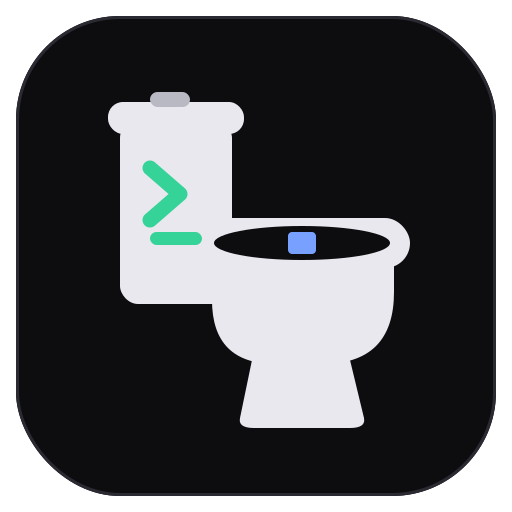

<div align="center">
  
  <h1>potty</h1>
  <p><em>A GPU-accelerated terminal emulator in Rust, with a deliberately visual, pointer-driven take on tabs and panes.</em></p>

  <p>
    <a href="https://copr.fedorainfracloud.org/coprs/decaychain/potty/"></a>
    <a href="https://github.com/decaychain/potty/releases/latest"></a>
    <a href="LICENSE"></a>
  </p>
</div>

A research spike — built for fun and to learn the stack — that grew into something genuinely
usable. Wayland-native (developed on KWin) and ported to Windows. Where most Rust terminals are
keyboard-purist, potty leans on the **mouse**: click to focus, drag dividers to resize, right-click
for the menu.

> Status: a **personal tool**, scoped to the author's own machines (Linux + Windows). Not a
> general-purpose product — but it runs real shells, multiplexes, and behaves well.

## Install

**Fedora** (via [COPR](https://copr.fedorainfracloud.org/coprs/decaychain/potty/) — updates come
with `dnf upgrade`):

```sh
sudo dnf copr enable decaychain/potty
sudo dnf install potty
```

**Windows** — grab the installer for your architecture from the
[latest release](https://github.com/decaychain/potty/releases/latest):
`potty-<version>-x64-setup.exe` or `potty-<version>-arm64-setup.exe` (a per-user install, no admin
needed).

Or [build from source](#build--run).

## Features

- **GPU per-cell renderer** — custom glyph atlas (cosmic-text + swash) and two instanced `wgpu`
  pipelines (cell backgrounds + foreground glyphs). Per-cell colour, bold (with the ANSI brighten
  convention), reverse video, a block cursor, and **damage tracking** (only changed panes are
  rebuilt; a busy background tab produces zero redraws).
- **Real multiplexing** — one PTY + `alacritty_terminal` grid **per pane**. A binary split tree
  drives tabs and panes; **drag the dividers to resize**. Background tabs keep running.
- **Visual chrome** (`egui`) — a tab bar that hides itself when there's only one tab, a `☰` /
  right-click pane menu (split, close, new tab), and a floating **Font settings** window. The
  chrome is mouse-only by design.
- **Selection & clipboard** — mouse selection (drag, double-click word, triple-click line),
  `Ctrl-C`/`Ctrl-V` with terminal-correct semantics, `Ctrl-Shift-C/V`, `Ctrl/Shift-Insert`,
  primary-selection middle-click paste (Linux), and **OSC 52** (opt-in for reads). Scrollback with
  wheel + `Shift-PageUp/Down/Home/End`.
- **Mouse reporting** — SGR-1006 / X10 forwarded to apps (vim, htop, Zellij…), with `Shift` to
  bypass into local selection.
- **Per-pane titles** — from OSC 0/2; shown in the tab label and propagated to the window title.
- **Configuration** — `potty.toml` (TOML), **hot-reloaded** on save: font family/size, a separate
  chrome font size, a full colour scheme, the shell, the OSC 52 policy, and per-profile remote
  environment variables.
- **Keyboard** — layout-resolved text (German/US, no IME needed) with an IME-commit safety net,
  DECCKM-aware cursor / navigation / function keys (so `mc` and ncurses apps work), and AltGr
  handling on Windows.
- **Attention feed** *(Linux)* — a floating list of agentic-CLI sessions (Claude Code, Codex)
  waiting on you, gathered out-of-band over a socket rather than scraped from the screen, so a
  session in a **background pane** still surfaces. Click an entry to jump to its pane. See
  [Attention feed](#attention-feed) and [the design doc](docs/attention-feed.md).

Remote profile environment variables live in `potty.toml` on the matching connection profile:

```toml
[[profiles]]
name = "work"
user = "alice"
host = "build.example.com"
port = 22
use_potty_session = true
env = { CODEX_HOME = "/srv/codex", FEATURE_FLAG = "remote" }
```

For `potty-session` connections, potty prefixes the remote command so these values are inherited
by panes. Plain-shell connections use SSH env requests, which OpenSSH only honors for names allowed
by the server's `AcceptEnv`.

## Attention feed

When you run several agentic CLIs at once they spend a lot of time *blocked on you* — a permission
prompt, a plan to approve. potty collects those into one floating list (top-right) so you never
babysit a pane to check "is it waiting yet?". The signal comes from the tool's own notification
hook via a tiny helper (`potty-notify`) over a Unix socket — **not** by watching the terminal
output — so a session in an unfocused pane still shows up. Click an entry to jump straight to it.

Wire it up once (the `potty` package installs `potty-notify` on `PATH`) — let the helper edit the
configs for you (idempotent, won't clobber existing settings):

```sh
potty-notify --install-hook claude   # ~/.claude/settings.json
potty-notify --install-hook codex    # ~/.codex/config.toml
```

<details><summary>…or wire them by hand</summary>

**Claude Code** — `~/.claude/settings.json`:

```json
{
  "hooks": {
    "Notification":     [{ "hooks": [{ "type": "command", "command": "potty-notify --tool claude" }] }],
    "UserPromptSubmit": [{ "hooks": [{ "type": "command", "command": "potty-notify --tool claude --clear" }] }]
  }
}
```

**Codex** — `~/.codex/config.toml`: `notify = ["potty-notify", "--tool", "codex"]`
</details>

**Over SSH** with potty's built-in `potty-session`: no extra socket forwarding is needed.
`potty-session` injects a remote-local `$POTTY_NOTIFY` socket into each remote pane and relays notes
back over the existing potty protocol, including notes raised while detached. For plain/manual
`ssh` sessions outside `potty-session`, `potty-notify --print-ssh-config <host>` and
`potty-notify --print-ssh-wrapper` still provide the older SSH `RemoteForward` setup. potty can't
switch the *remote* Zellij tab for you, but the entry shows which one to go to. Details in the
[design doc](docs/attention-feed.md#phasing).

A session outside potty (or on a host without the socket) just no-ops — the hook is harmless.

## Platforms

| | |
|---|---|
| **Linux** | Wayland-native, developed on **KWin**. Clipboard via `smithay-clipboard` (the app's own seat — no XWayland). Config at `~/.config/potty/potty.toml`. |
| **Windows** | MSVC build. PTY via **ConPTY**, clipboard via the Win32 API (`arboard`), default shell `cmd.exe` (override with `shell` in the config). Config at `%APPDATA%\potty\potty.toml`. |

> **Windows 10 limitation:** mouse reporting into console apps over SSH (e.g. Midnight Commander)
> does **not** work. The inbox ConPTY on Windows 10 doesn't pass mouse sequences through to/from
> console clients — the same potty code works fine on Linux, and this is expected to work on
> Windows 11's newer ConPTY. Everything else (keyboard, clipboard, AltGr, tabs/panes/resize) works.

## Build & run

Requires a recent Rust toolchain.

```sh
cargo run --release
```

On **Windows** you'll also need the **MSVC build tools** (Visual Studio Build Tools →
"Desktop development with C++") for the linker and Windows SDK.

A config file is written on first run; edit it and changes apply live.

## Stack

`winit` · `wgpu` · `cosmic-text` + `swash` · `alacritty_terminal` + `vte` · `portable-pty` ·
`egui` · `smithay-clipboard` / `arboard`

## Scope & non-goals

The narrow scope is deliberate — it's what keeps the project tractable: no IME, no broad
multi-compositor support, no exotica (sixel / kitty graphics / ligatures / hyperlinks) until
they're actually missed. Keyboard shortcuts are intentionally omitted in favour of the mouse.

## License

[MIT](LICENSE) — do what you like with it.
